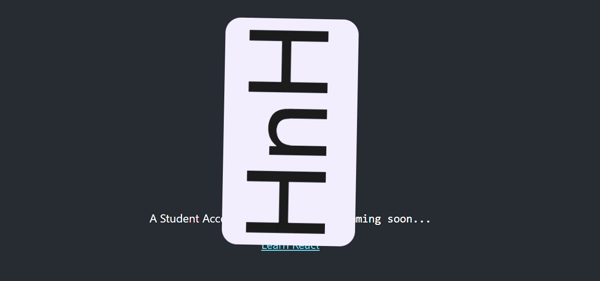
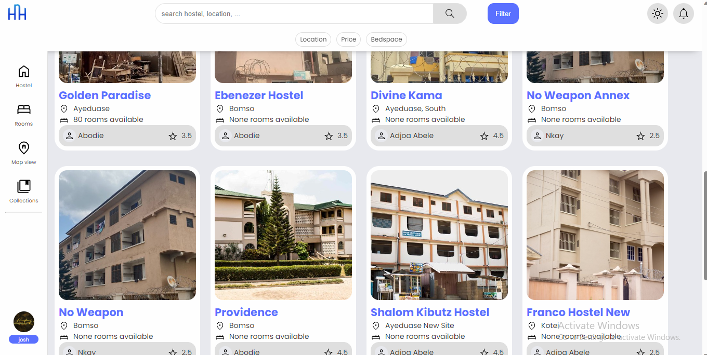
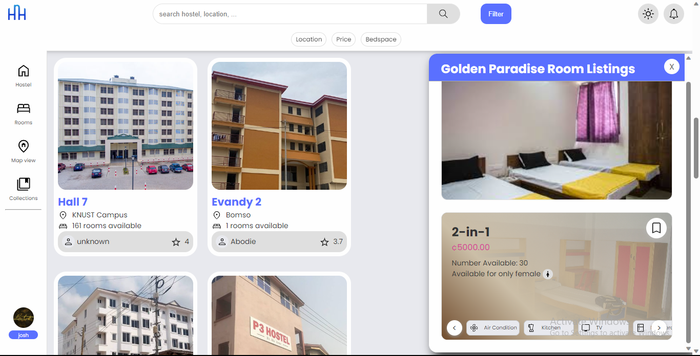
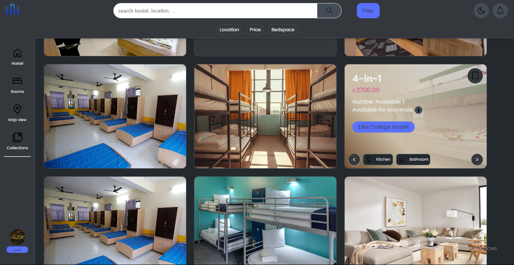
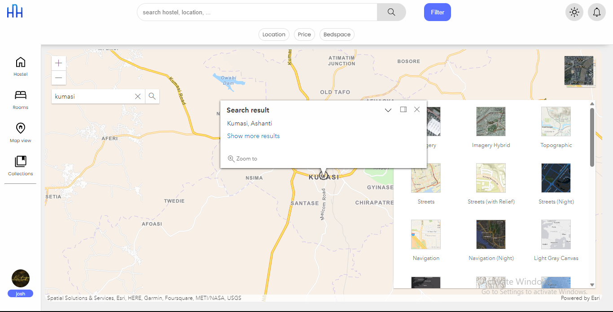

# HnH Accommodation

A hall, hostel and homestel booking web application to help students discover available accommodation options in their school of choice.

This is hte frontend of the application. The backend is available at [hnh-backend](https://github.com/esmond-adjei/hnh-backend)

---

---

# Hostels view

# Rooms and Hostel browse view

# Rooms view (dark mode)

# Map view

